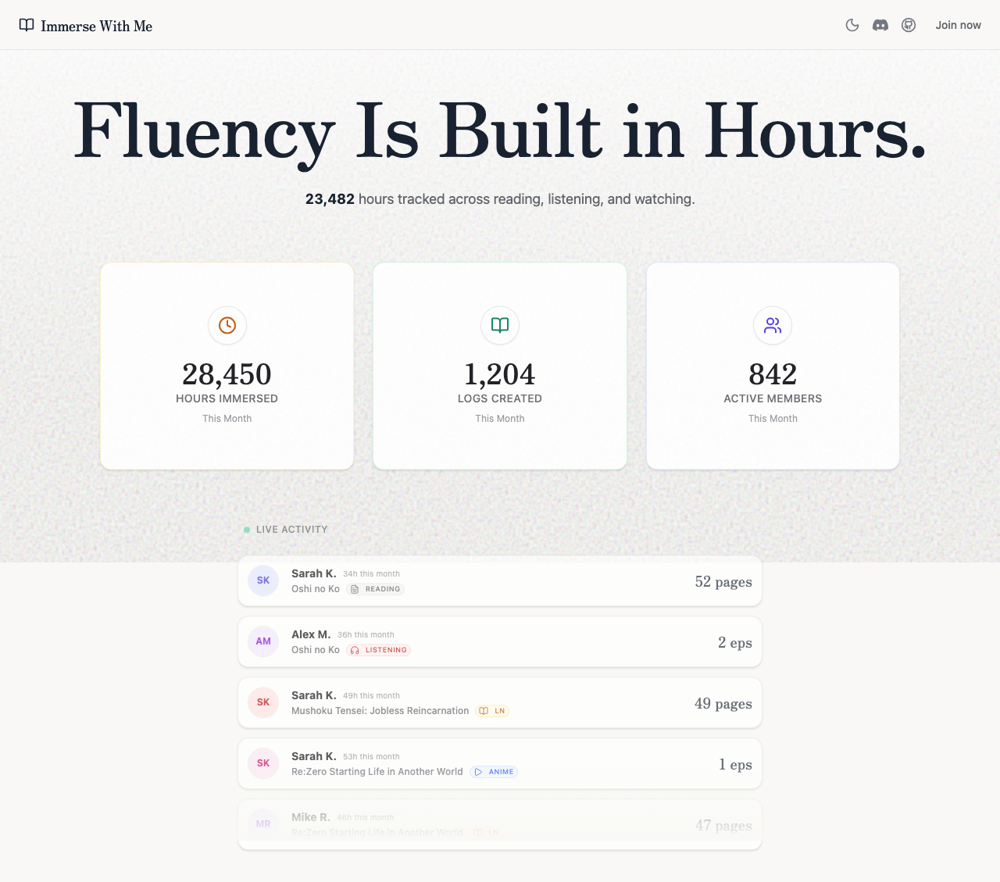
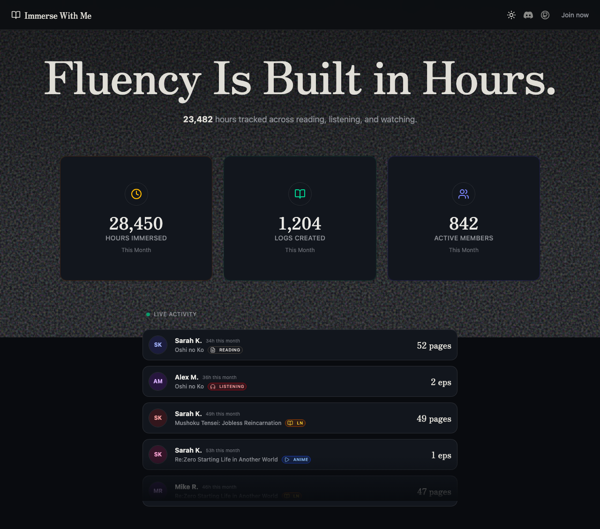
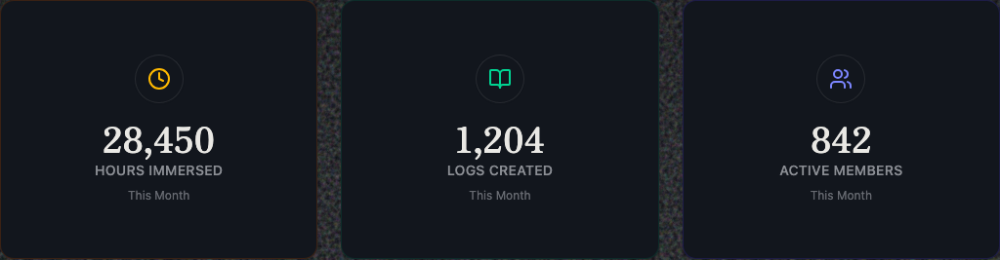
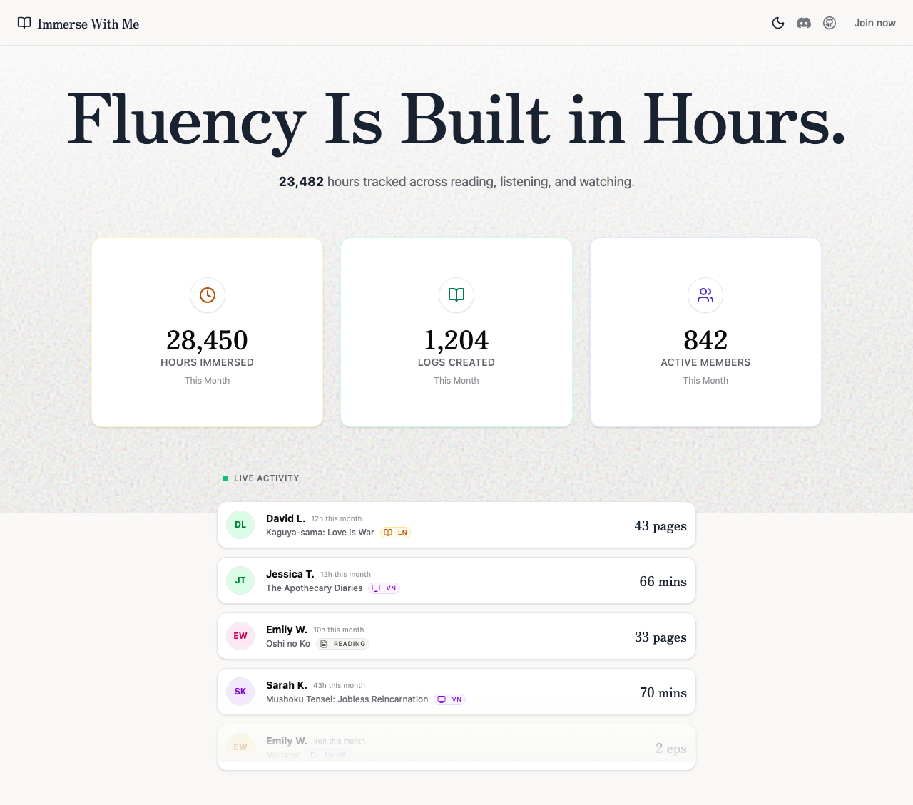

## Automated PR Review

   

> [!CAUTION]
> **Bug: `theme` vs `resolvedTheme` in ThemeToggle** -- When `defaultTheme="system"` is set on the ThemeProvider, `useTheme().theme` returns `"system"` instead of the actual resolved theme (`"light"` or `"dark"`). This causes the toggle icon and behavior to be wrong when the user hasn't explicitly set a preference yet. Fixed by using `resolvedTheme` instead.
> ```diff
> - const { theme, setTheme } = useTheme()
> + const { resolvedTheme, setTheme } = useTheme()
> ```
> [`theme-toggle.tsx#L6`](https://github.com/mshuffett/immerse-with-me/blob/feat/dark-mode/src/components/theme-toggle.tsx#L6)

<details>
<summary><strong>Tests (4 added, all passing)</strong></summary>

| Suite | Count | Status | Link |
|-------|:-----:|:------:|:----:|
| Dark Mode Toggle - render & switch | 1 | Passing | [`dark-mode.spec.ts`](https://github.com/mshuffett/immerse-with-me/blob/feat/dark-mode/e2e/dark-mode.spec.ts#L4) |
| Dark Mode Toggle - aria-label | 1 | Passing | [`dark-mode.spec.ts`](https://github.com/mshuffett/immerse-with-me/blob/feat/dark-mode/e2e/dark-mode.spec.ts#L45) |
| Dark Mode Toggle - background color | 1 | Passing | [`dark-mode.spec.ts`](https://github.com/mshuffett/immerse-with-me/blob/feat/dark-mode/e2e/dark-mode.spec.ts#L65) |
| Dark Mode Toggle - toggle back | 1 | Passing | [`dark-mode.spec.ts`](https://github.com/mshuffett/immerse-with-me/blob/feat/dark-mode/e2e/dark-mode.spec.ts#L92) |

**Test output:**
```
Running 4 tests using 1 worker

  ✓  1 › Dark Mode Toggle › renders in light mode by default and can switch to dark (2.1s)
  ✓  2 › Dark Mode Toggle › toggle button has correct aria-label (1.4s)
  ✓  3 › Dark Mode Toggle › dark mode applies correct background color (1.5s)
  ✓  4 › Dark Mode Toggle › can toggle back to light mode (2.1s)

  4 passed (8.8s)
```

</details>

### UI Verification

<details>
<summary><strong>Light Mode vs Dark Mode (Full Page)</strong></summary>

<table>
<tr>
<td align="center"><strong>Light Mode</strong></td>
<td align="center"><strong>Dark Mode</strong></td>
</tr>
<tr>
<td></td>
<td></td>
</tr>
</table>

</details>

<details>
<summary><strong>Header with Theme Toggle</strong></summary>

<table>
<tr>
<td align="center"><strong>Light Mode (Moon icon)</strong></td>
<td align="center"><strong>Dark Mode (Sun icon)</strong></td>
</tr>
<tr>
<td></td>
<td></td>
</tr>
</table>

</details>

<details>
<summary><strong>Stats Cards (Dark Mode)</strong></summary>



</details>

<details>
<summary><strong>Round-trip Toggle (Light Restored)</strong></summary>



</details>

### Summary

**What this PR does well:**
- Clean ThemeProvider setup wrapping the app at the root level
- Proper use of CSS variables for theme colors (oklch color space)
- Consistent dark mode variants on all Tailwind utility classes
- Hydration-safe ThemeToggle with `mounted` state check
- Good accessibility with dynamic `aria-label`
- `disableTransitionOnChange` prevents flash during theme switch

**What was fixed:**
- Used `resolvedTheme` instead of `theme` in ThemeToggle to correctly handle `defaultTheme="system"` mode

**What was added:**
- 4 Playwright e2e tests covering toggle behavior, aria-labels, CSS variable verification, and round-trip toggling
- 7 screenshots verifying both themes render correctly
